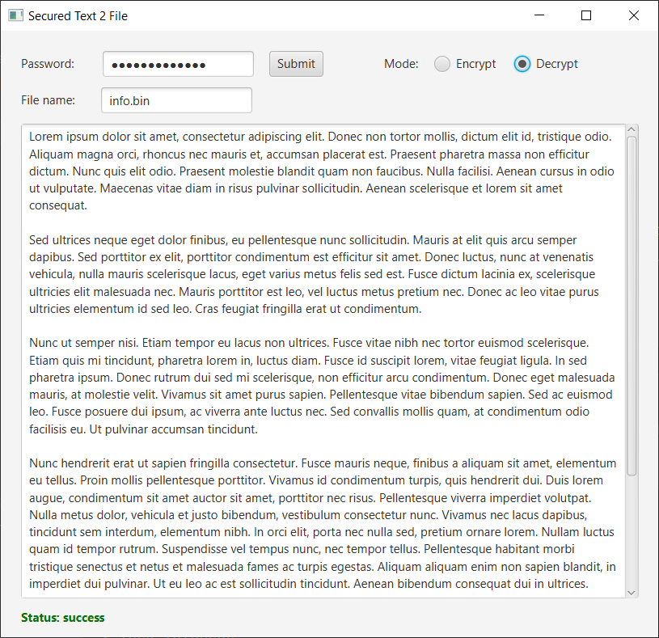

Secured Text 2 File
--
**Description**<br/>
Secure store any text to an AES256 hidden zip file. (binaries provided also, see end of this file) <br/>
Can be used as a password manager.<br/>
Output file defaults to info.bin in the current directory. This can be changed if needed. <br/>
While there are a lot of self-extracting archive managers with encryption, this little 
program has the advantage that it extracts and display the content of the encrypted file in his little frame without the need to use an external text editor.<br/>
This eliminates the step to delete the raw sensible file after visualization/decryption that can lead to other security problems, like forgetting to empty the recycle bin.<br/>

E.g: Encrypt your drive with bitlocker then use this program to add an extra security layer for your important text/passwords.

**Features summary:**
1) No need for external editor to view your decrypted text
2) No need to delete your decrypted text after you've read it
3) Leaves no footprint like temp files
4) No network connections

**Usage:**<br/>
Requires JDK 17<br/>
To generate the bin files use the following gradle tasks<br/>
For a java distribution run the command below and check folder: ./build/install/secured-text2file/bin<br/>
```
./gradlew clean installDist
```
For native OS executable run the command below and check folder: ./build/image/bin
```
sudo apt-get install binutils //only for linux
./gradlew clean jlinkZip 
```
**Note:**  To skip building and run directly on your computer install JDK17+ and run the script file inside folder:<br/>
./dist/your-OS/secured-text2file-v2/bin/ 

Screenshot:<br/>
